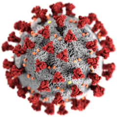

Coronavirus Antivirals
~~~~~~~~~~~~~~~~~~~~~~

This project hopes to discover an antiviral that can treat the novel
coronavirus disease. This project will use newer approaches in machine learning to 
model and optimize for the properties needed in candidate therapeutics.

In therapeutic drug development the properties we minimize are toxicity and 
side-effects (also called “off-target effects”). Properties we maximize are 
bioactivity on target (also called "on-target effects"), absorption, 
synthesizability, and large-scale manufacturability. 

We aim to search the molecular space (both drug-like molecules, and 
already approved drugs) for drug candidates maximizing these properties.

How to Contribute
~~~~~~~~~~~~~~~~~

We need your help if you have one of the following skills:

* Software development in Python
* Machine learning
* Web development (for the UI)
* Cheminformatics
* DevOps -- especially with Kubernetes and Helm

Fork the project and create a new branch:

::

    git checkout -b feature/my_new_feature

Push your changes and use GitHub to submit a pull request.

Any contributions are helpful. Look at the open issues for inspiration 
on what to work on.

License
~~~~~~~

Apache 2. See LICENSE file for details.

Installation
~~~~~~~~~~~~

Using the system through our highly optimized Docker container is recommended:

:: 

    docker run -v my_host_data_directory:/app/data -it inqtel/antivirals up sqlite:////app/data/antivirals.db

Alternatively, we publish a Python package:

::

    pip install antivirals

Architecture
~~~~~~~~~~~~
The system is structured in a quazi Model-View-Controller (MVC) architecture.

* __init__.py: Agents that execute operations and connect everything together. The "controller" layer in MVC.
* schema.py: Contains all the code for adding to and querying the molecular database. The "model" layer in MVC.
* __main__.py: A command-line user interface. The "view" layer in MVC.
* data.py: Maps from public datasets (eg. ZINC Clean Leads, Tox21) to the molecular database schema.
* chem.py: The actual cheminformatics machine learning algorithms.
* parser.py: A Cython-optimized SMILES language parser used by the cheminformatics algorithms. 

We are investigating how to deploy it at scale on Kubernetes. Help is needed!

Usage
~~~~~

The Coronavirus Antivirals project comes bundled with a command line tool.

You must have a `SQLAlchemy compatible database <https://docs.sqlalchemy.org/en/13/core/engines.html>`_ 
running. Otherwise everything gets stored in volitile memory. Any database string can be used in theory, 
but it has only been tested with SQLite.

To completely set up the project and run an agent that runs indefinitely doing antivirals experiments, simply run:

::

    antivirals up sqlite:///path/to/your/db

This command sets up the whole Coronavirus Antivirals system de novo (downloading data, training models, etc).

Any models generated will be dumped in the current working directory in "data". When you use Docker 
or Kubernetes you want to mount the /app/data folder in the container to a volume.

There is some more advanced usage. Inline documentation about other actions is available:

::

    antivirals -h

Acknowledgment
~~~~~~~~~~~~~~

A project of `B.Next <https://www.bnext.org/>`_.